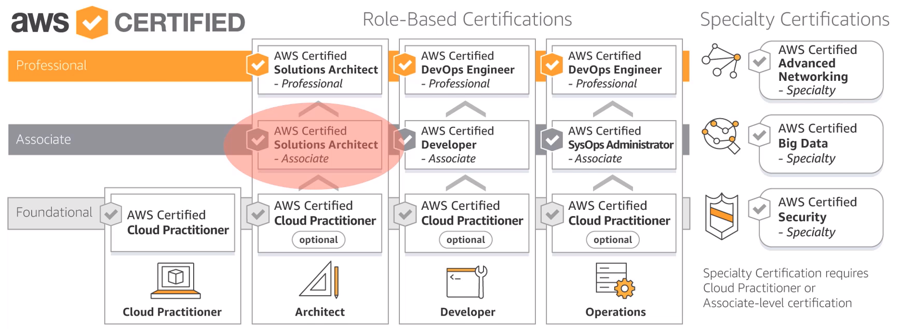
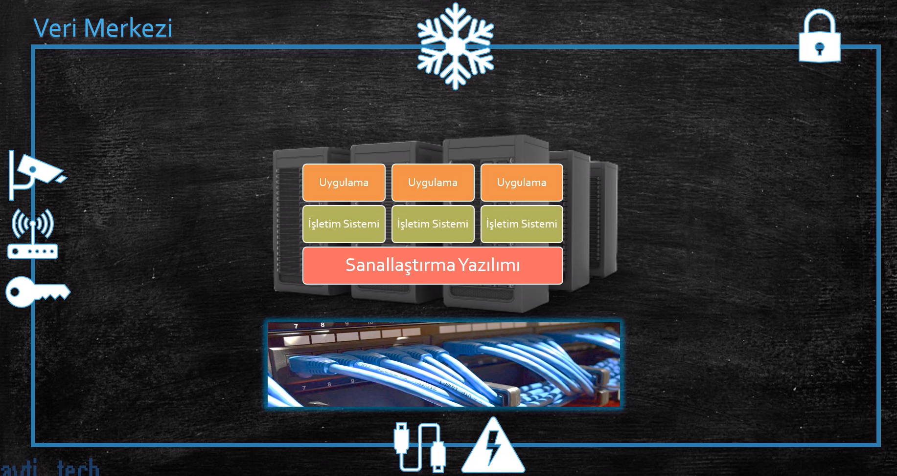
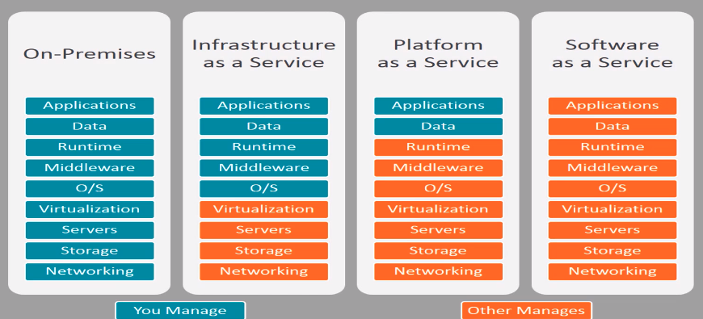
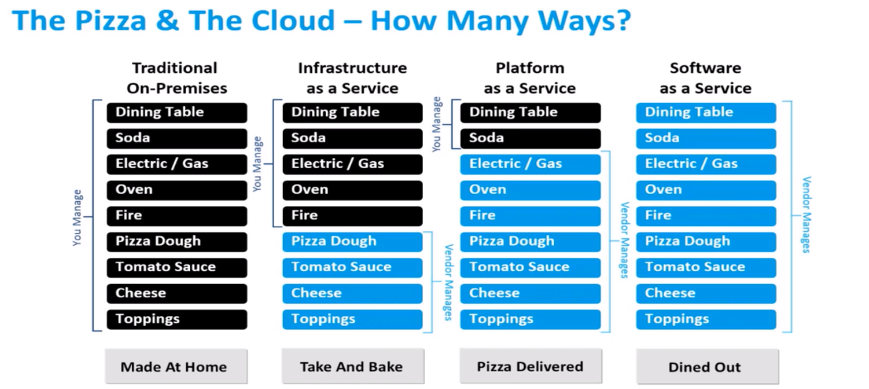
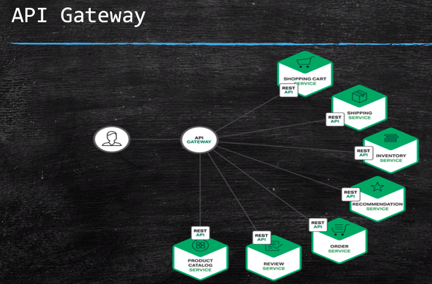
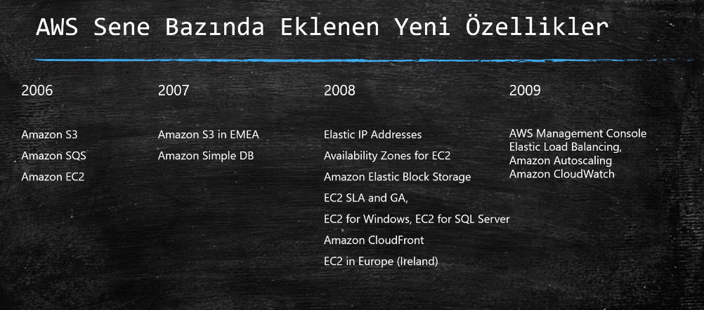
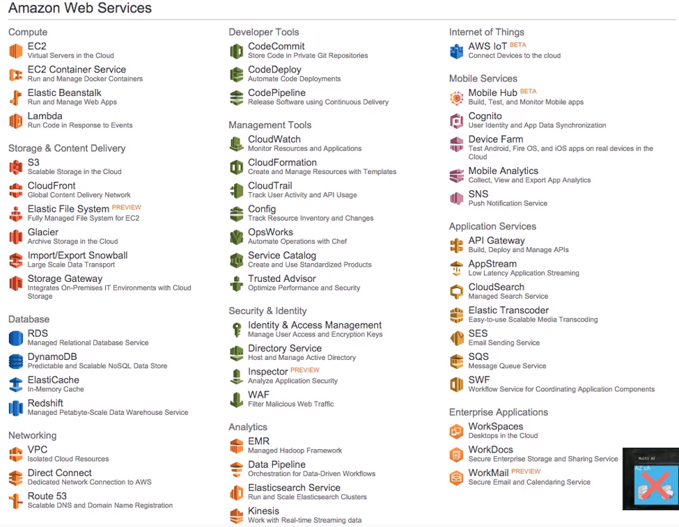
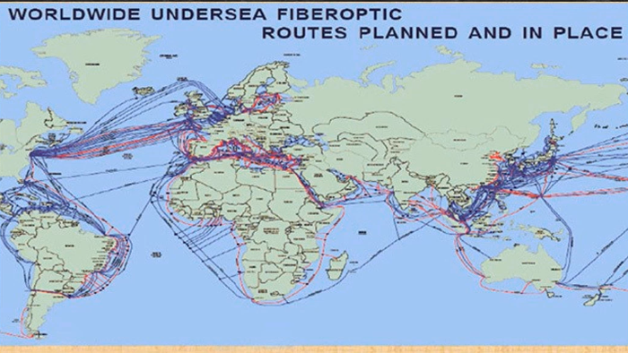
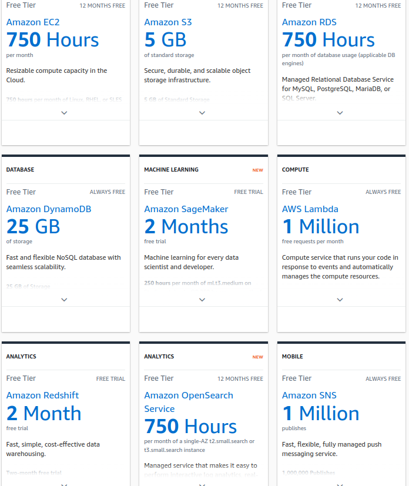

# AWS-Notes

This is listing my learning from [Cloud Computing Basics and Introduction to AWS Solution Architect](https://www.udemy.com/course/bulut-bilisim-temelleri-ve-aws-cozum-mimarligina-giris/).

## Introduction & Cloud History

1) The reason why Cloud Computing became popular is that Network capabilities have developed a lot.

2) 93% of companies use cloud computing in any way.

3) AWS is bigger than the collection of Microsoft Azure, Google Cloud, Alibaba cloud, IBM cloud and oracle cloud.

4) AWS Certificates:



5) In order to install AWS CLI, activate a Python environment and install the following

```run.sh
pip install awscli
```


6) Virtualization software is installed on top of physical machine.

7) How to build a data center

    - Security, not allowinh everyone to enter
    - Keeping the temperature cold
    - UPS devices against short electricity cuts and generators against long electricity cuts.
    - Buy rack cabinets to place servers(physical machines)
    - Providing networking via ethernet cables.
    - Security cameras to secure data center



8) Some companies decided to have a single data center rogether rather than multiple data centers. This concept is called as **colocation**. In this concepts, each company has different rack cabinets. This approach reduced the cost of air-conditioning&security dramatically but not didn't solve the capacity problem.

9) IaaS solved the problem of insfrasracture, capacity and data centers by intorucing selling Vm's for customer directly. The IaaS provider is responsible for all physical infrastructure. The renters are responsiblge for their VM's.

10) Cloud computing is not a product, it is a service.

11) On premises, IaaS, PaaS, SaaS



12) AWS EC2(Elastic compute cloud) is an example of IaaS. AWS Elastic Beanstalk is an example of PaaS. AWS Workdocs(similar to Microsoft sharepoint) is an example of SaaS.

13) PaaS is a further step to IaaS. In PaaS, we are just managing data and application and other layers are managed by our providers. AWS Elastic Beanstalk is an example of PaaS. Heroku is an example of PaaS too.

14) In SaaS, everything is under the responsibility of our provider. We are just using it by paying. Gmail is an example of SaaS.

15) Pizza metaphore for On premises, IaaS, PaaS, SaaS



16) Beta Release is carried out with customer. Beta version is launched and sent to customer first, then feedbacks are taken into consideration.

17) SaaS is predominant now in industry. SaaS is like renting a car rather than purchasing a car.

18) DevOps is a philasophy, not a method.

19) Docker, Jenkins, Ansible, Chef and Github actions are some softwares that are used in CI/DC processes.

20) Monolith applications are

    - hard to sustain
    - not flexible
    - hard to fix
    - having only one codebase
    - bulky

21) API is an explicitly defined communication management approach among different applications.

22) API Gateway is illustrated below. Common missions of API Gateway is direction, merging and protocol translation. Also, they are responsible for authentication, load balancing, monitoring. "One Api to rule them all".



## AWS History

1) AWS was first created in 2002 and launced in 2006.

2) Some AWS Services year by year



3) AWS Official Sources:

    - [https://aws.amazon.com/new/](https://aws.amazon.com/new/)
    - [https://aws.amazon.com/blogs/aws/](https://aws.amazon.com/blogs/aws/)

4) AWS re:invent is a yearly conference held at late November & early December. It is the most transformative event in tech. It is in Las Vegas and more than 40k IT engineers are attending. Its price is around 1800 dollar.

5) There are more than 200 AWS services as of November 2022. Some AWS Services:



6) World undersea fiberoptic routes



7) AWS has many regions like North America or Central Europe. Each region has at least 2 Availability zones (AZ). Each AZ are connected to each other in the ame region.

8) In order to deliver static content better, CDN(Content Delivery Network) was introduced. AWS has a CDN service called CloudFront. There are 149 edge locations in AWS, which deliver static content.

9) [aws.amazon.com/free](https://aws.amazon.com/free/?all-free-tier.sort-by=item.additionalFields.SortRank&all-free-tier.sort-order=asc&awsf.Free%20Tier%20Types=*all&awsf.Free%20Tier%20Categories=*all) is a free website to learn AWS services without paying money.



10) We can manage AWS via GUI or CLI.

11) The oldest regions on AWS is Virginia & Ireland. There are some services that are available on one region, and not on another region. To view which region has which services, take a look at [here](https://aws.amazon.com/about-aws/global-infrastructure/regional-product-services/). Solution architexts use this information in building architectures.

12) We can assign tags to AWS services that we created. These tags are in the format of key:pair(Json file alike or Python dictionary alike). Then, we can list a resource group composed of different services with this tag.

13) It is good to know Account ID. It is shown under username -> Account tab. It is a 12-digit number. It is used in case of call center contact & ticket support etc.

14) IAM means identity and access management. IAM service prodives us with new created users. AWS doesn't want us to make operations as root. Therefore, we are required to create IAM users and make operations via these new users. IAM users can't access to billing pages or other administrative pages.

15) Cost Explorer is a tab in Account page. It enables us to view details of our costs.

## Introduction to AWS Services

1) Compute is listing server services. 

    - EC2 is the most important service.
    - Lightsait is similar to EC2, but appropriate for test & dev enrionments and small businesses.
    - ECS is Elastic container service and it is a container orchestration tool.
    - EKS is Elastic Kubernetes service.
    - AWS Lambda is providing code execution without server management. You only pay the consumption.
    - AWS Batch: Automated batch processing.
    - Elastic Beanstalk: An orchestration service which orchestrates many AWS Serices like EC2, S3, Elastic Load Balancers. It is a PaaS service.


2) The 2 hot topics in the industry are Container & Serverless. AWS Lambda is a Serverless service. It reduces costs of developing applications.

3) Storage is listing storage-linked services.
    - S3: This is the service that booms Cloud Computing. It is storing the data irrespective of its source. S3 is object-base rather than blog-based. We can hold files whose sizes are between 0 KB to 5 TB.
    - Elastic File System: It can be thought as a flexible hard disk. Many computers can access to it simultaneously.
    - Glacier: Long-term & cheap & archiving service. Similar to S3.
    - Storage Gateway: Some firms use their own servers locally. owever, they want to keep their backups on the cloud in case of disaster recovery.

4) Database services are listed below.

    - RDS: Relational database services. It faciliates executing and scaling of databases(Amazon Aorora).
    - DynamoDB: Nonrelational database services.
    - ElastiCache: Providing completely managable Redis & Memcached. It is a cache memory service. Used in gaming.
    - Neptune: Appropriate for Graph DB's.
    - Redshift: It is a database in fact but specialized in merging different data from different sources. 10x faster than other data warehouses. THe reason why to use Redshift is that we don't want to consume the resources of our databases. Instead, we move the data to Redshift and query in Redshift.

5) Networking and Content Delivery

    - VPC: Virtual Private Cloud. It is a virtual network on the cloud. We can customize our network.
    - CloudFront: It is a CDN(Content Delivery Network) service.
    - Route53: It is a DNS(Domain Name Service). It is an alternative to GoDaddy. DNS runs on UDP 53 port and this is why it is named as Route53.
    - API Gateway: An API management tool bult in front of API.
    - Direct Connect: It is a cloud service faciliating the installation of deciated & private link between our local servers to AWS servers. It is a replacement for internet connection.


