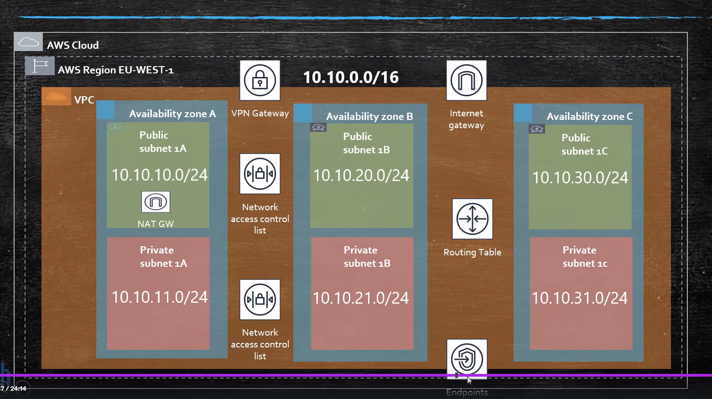
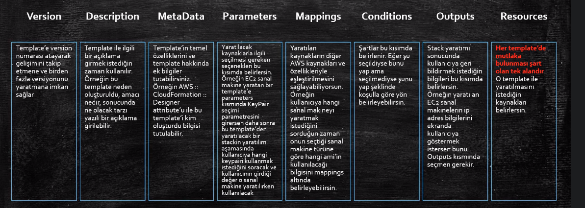

# AWS-Notes

This is listing my learnings from [Cloud Computing Basics and Introduction to AWS Solution Architect](https://www.udemy.com/course/bulut-bilisim-temelleri-ve-aws-cozum-mimarligina-giris/).

## Introduction & Cloud History

1) The reason why Cloud Computing became popular is that Network capabilities have developed a lot.

2) 93% of companies use cloud computing in any way.

3) AWS is bigger than the collection of Microsoft Azure, Google Cloud, Alibaba cloud, IBM cloud and oracle cloud.

4) AWS Certificates:


5) In order to install AWS CLI, activate a Python environment and install the following

```run.sh
pip install awscli
```


6) Virtualization software is installed on top of physical machine.

7) How to build a data center

    - Security, not allowinh everyone to enter
    - Keeping the temperature cold
    - UPS devices against short electricity cuts and generators against long electricity cuts.
    - Buy rack cabinets to place servers(physical machines)
    - Providing networking via ethernet cables.
    - Security cameras to secure data center


8) Some companies decided to have a single data center rogether rather than multiple data centers. This concept is called as **colocation**. In this concepts, each company has different rack cabinets. This approach reduced the cost of air-conditioning&security dramatically but not didn't solve the capacity problem.

9) IaaS solved the problem of insfrasracture, capacity and data centers by intorucing selling Vm's for customer directly. The IaaS provider is responsible for all physical infrastructure. The renters are responsiblge for their VM's.

10) Cloud computing is not a product, it is a service.

11) On premises, IaaS, PaaS, SaaS


12) AWS EC2(Elastic compute cloud) is an example of IaaS. AWS Elastic Beanstalk is an example of PaaS. AWS Workdocs(similar to Microsoft sharepoint) is an example of SaaS.

13) PaaS is a further step to IaaS. In PaaS, we are just managing data and application and other layers are managed by our providers. AWS Elastic Beanstalk is an example of PaaS. Heroku is an example of PaaS too.

14) In SaaS, everything is under the responsibility of our provider. We are just using it by paying. Gmail is an example of SaaS.

15) Pizza metaphore for On premises, IaaS, PaaS, SaaS


16) Beta Release is carried out with customer. Beta version is launched and sent to customer first, then feedbacks are taken into consideration.

17) SaaS is predominant now in industry. SaaS is like renting a car rather than purchasing a car.

18) DevOps is a philasophy, not a method.

19) Docker, Jenkins, Ansible, Chef and Github actions are some softwares that are used in CI/DC processes.

20) Monolith applications are

    - hard to sustain
    - not flexible
    - hard to fix
    - having only one codebase
    - bulky

21) API is an explicitly defined communication management approach among different applications.

22) API Gateway is illustrated below. Common missions of API Gateway is direction, merging and protocol translation. Also, they are responsible for authentication, load balancing, monitoring. "One Api to rule them all".


## AWS History

1) AWS was first created in 2002 and launced in 2006.

2) Some AWS Services year by year


3) AWS Official Sources:

    - [https://aws.amazon.com/new/](https://aws.amazon.com/new/)
    - [https://aws.amazon.com/blogs/aws/](https://aws.amazon.com/blogs/aws/)

4) AWS re:invent is a yearly conference held at late November & early December. It is the most transformative event in tech. It is in Las Vegas and more than 40k IT engineers are attending. Its price is around 1800 dollar.

5) There are more than 200 AWS services as of November 2022. Some AWS Services:


6) World undersea fiberoptic routes


7) AWS has many regions like North America or Central Europe. Each region has at least 2 Availability zones (AZ). Each AZ are connected to each other in the ame region.

8) In order to deliver static content better, CDN(Content Delivery Network) was introduced. AWS has a CDN service called CloudFront. There are 149 edge locations in AWS, which deliver static content.

9) [aws.amazon.com/free](https://aws.amazon.com/free/?all-free-tier.sort-by=item.additionalFields.SortRank&all-free-tier.sort-order=asc&awsf.Free%20Tier%20Types=*all&awsf.Free%20Tier%20Categories=*all) is a free website to learn AWS services without paying money.


10) We can manage AWS via GUI or CLI.

11) The oldest regions on AWS is Virginia & Ireland. There are some services that are available on one region, and not on another region. To view which region has which services, take a look at [here](https://aws.amazon.com/about-aws/global-infrastructure/regional-product-services/). Solution architexts use this information in building architectures.

12) We can assign tags to AWS services that we created. These tags are in the format of key:pair(Json file alike or Python dictionary alike). Then, we can list a resource group composed of different services with this tag.

13) It is good to know Account ID. It is shown under username -> Account tab. It is a 12-digit number. It is used in case of call center contact & ticket support etc.

14) IAM means identity and access management. IAM service prodives us with new created users. AWS doesn't want us to make operations as root. Therefore, we are required to create IAM users and make operations via these new users. IAM users can't access to billing pages or other administrative pages.

15) Cost Explorer is a tab in Account page. It enables us to view details of our costs.

16) Some Infrastructure as code tools are
    - Terraform
    - Ansible
    - Puppet
    - Chef

## Introduction to AWS Services

1) Compute is listing server services. 

    - EC2 is the most important service.
    - Lightsait is similar to EC2, but appropriate for test & dev enrionments and small businesses.
    - ECS is Elastic container service and it is a container orchestration tool.
    - EKS is Elastic Kubernetes service.
    - AWS Lambda is providing code execution without server management. You only pay the consumption.
    - AWS Batch: Automated batch processing.
    - Elastic Beanstalk: An orchestration service which orchestrates many AWS Serices like EC2, S3, Elastic Load Balancers. It is a PaaS service.


2) The 2 hot topics in the industry are Container & Serverless. AWS Lambda is a Serverless service. It reduces costs of developing applications.

3) Storage is listing storage-linked services.
    - S3: This is the service that booms Cloud Computing. It is storing the data irrespective of its source. S3 is object-base rather than blog-based. We can hold files whose sizes are between 0 KB to 5 TB.
    - EFS(Elastic File System): It can be thought as a flexible hard disc. Many computers can access to it simultaneously.
    - Glacier: Long-term & cheap & archiving service. Similar to S3.
    - Storage Gateway: Some firms use their own servers locally. owever, they want to keep their backups on the cloud in case of disaster recovery.

4) Database services are listed below.

    - RDS: Relational database services. It faciliates executing and scaling of databases(Amazon Aorora).
    - DynamoDB: Nonrelational database services.
    - ElastiCache: Providing completely managable Redis & Memcached. It is a cache memory service. Used in gaming.
    - Neptune: Appropriate for Graph DB's.
    - Redshift: It is a database in fact but specialized in merging different data from different sources. 10x faster than other data warehouses. THe reason why to use Redshift is that we don't want to consume the resources of our databases. Instead, we move the data to Redshift and query in Redshift.

5) Networking and Content Delivery

    - VPC: Virtual Private Cloud. It is a virtual network on the cloud. We can customize our network.
    - CloudFront: It is a CDN(Content Delivery Network) service.
    - Route53: It is a DNS(Domain Name Service). It is an alternative to GoDaddy. DNS runs on UDP 53 port and this is why it is named as Route53.
    - API Gateway: An API management tool bult in front of API.
    - Direct Connect: It is a cloud service faciliating the installation of deciated & private link between our local servers to AWS servers. It is a replacement for internet connection.

6) Migration

    - Migration Hub: A monitoring too for AWS migration operations.
    - Application Discovery: A service to discover applications on local servers before migration.
    - Database Migration Service: A migration service for databases. It supports homogeneous( example: Postgresql to Postgresql) & heterogeneous (MySQL to Amazon Aurora) migrations.
    - Server Migration Service: A service to move local servers to AWS servers.
    - Snowball: A migration tool to move Petabytes of data to AWS. It is a PHYSICAL device. AWS sends it to you. You put your data into this device in a encrypted way. You send it back to AWS. AWS restores services via this PHYSICAL device.

7) Management Tools are used in managing AWS Resources

    - Cloudwatch: A monitoring tool for RAM, CPU, disc, bandwith etc on servers. For example, if CPU limit exceeds 80 %(detected by Cloudwatch), then add a new server etc.
    - CloudTrail: A monitoring tool for all activities on AWS. Some activities are like who deleted S3 service, who increased the RAM of EC2 etc.
    - CloudFormation: A service suitable for repetitive task. For example, we create a cluster of virtual servers once a day. Then we are destroying them all. Instead of doing this manually, we are writing our instructions in a file(similar/equivalent to infrastructure as code solutions), then run them on CloudFormation.
    - Autoscaling: A service to automatically scale AWS resource in case of heavy load(CPU Bound > 80%).
    - Config: A monitoring tool for configuration settings. Configuration version of CloudTrail. It takes snapshots of current configuration settings.
    - Opsworks: A service version of Chef & Puppet in AWS world.
    - SystemCatalog: A service to restrict which IAM users can access to which service.
    - SystemsManager: A service providing us with managing all of our resources at the same time. For example, we want to upgrade OS's of our EC2 instances to Ubuntu Server 22.04 at the same time. It is possible with SystemsManager.
    - AWS Trusted Advisor: A service which suggests best practices for our existing services. For instance, there are 2 cores on our EC2 instance but our CPU doesn't exceed 30%. In this scenario, Trusted Advisor suggests us to reduce core number of our machine.
    - AWS Managed Services: A service listing 3rd party vendors of AWS. You can get support from these vendors. If we don't want to run our AWS infrastructure and want a 3rd party firm to manage it, these firms are ready on Managed Services

8) Security, Identity & Compliance

    - IAM: Identity and Access Management, managing accesses to AWS services and Resources. It is the heart of AWS.
    - Amazon Cognito: A service to faciliate log in activities via Google, Facebook, Amazon.
    - Secrets Manager: A service for hiding credentials(API keys, DB username passwords etc). You send a request to Secrets Manager API to use the info in your code.
    - Guard Duty: A security service monitoring all AWS services. It detectes anomally API calls etc via Machine Learning Algorithms.
    - Inspector: A security service detecting security bugs in our apps.
    - Macie: A service detecting sensitive data on S3. Detection is carried out through Machine Learning.
    - SSO - Single Sign On: Its logic is similar to 1password.
    - Certificate Manager: A service for SSL/ TLS certificates. Its logic is similar to let's encrypt.
    - CloudHSM - Hardware Security Module: An encrypting service for our data(not well understood)
    - AWS Active Directory.
    - WAF - Web Application Firewall: It protects our apps deployed on AWS from attacks like sql injection.
    - Shield: A serice protecting us from ddos attacks.
    - Artifact: A tool to obtain documents for auditing.

9) Application Integration

    - SQS (Single Queue Service): A message broker service, similar to RabbitMQ and Kafka. It is simple and con so comprehensive.
    - SNS: Simple Notification Service: One of the most used Amazon Services. It prompts alerts & notifications. For example, a pop-up appearing on our phone from an e-commerce app can come from this service. An alert generated by CloudWatch may come from this service. It is one of the most important AWS services.
    - SWF: Single Workflow Service. Similar to Apache airflow.
    - Step Functions: It is enabling us to run multiple AWS services consecutively in a **serverless** manner.
    - MQ Message Queue: Based on RabbitMQ, but more extensive compared to SQS. 

10) Analytics:

    - Athena: It is used to make SQL queries on S3. It is interactive and serverless. You pay as you use.
    - Elastic MapReduce: A tool to store big data. It is an alternative to Apache Hadoop.
    - CloudSearch: A tool to make search possible on our websites, supporting more than 30 languages
    - Elasticsearch: Similar to elastic search, read operations are fast, for example log analysis is an area that amazon elasticsearch service used.
    - Kinesis: A tool making real time analysis, used with IoT devices.
    - Quicksight: A BI tool, similar to PowerBI & tableau
    - AWS Data Pipeline: A service to transfer data between different services(S3, RDS, DynamoDB)
    - Glue: A tool for ETL

11) Customer Engagement:
    - SES (Simple Email Service):  An email sender. An alternative to Sendgrid. It is used in campaigns. If you also want to add a feature of sending emails to your app, SES might be a choice.
    - Amazon Connect: A call center service for small companies. Amazon uses this service in its Call Center Operations
    - Amazon Pinpoint: A service to send push messages(a discount by 20%, a new t-shirt appearing etc). It not only sends push messages, but also analyzes the data before sending push messages.

12) Mobile Services:
    - Mobile Hub: It isn't a service, it is an interface. It visualizes the services constituting the mobile app.
    - AppSync: A tool to syncronize offline apps. For instance, your connection was cut off. When you connect to internet, you should be able to view latest tweets on Twitter. This is what AppSync does.
    - DeviceFarm: A service to physically test our mobile app. Let's assume that you developed an android app and want to test it. There are many phone brands and each brand has different phone models. DeviceFarm service tests our app on different models of phones.

13) Desktop & App Streaming:

    - Workspaces: It is called VDI(virtual desktop). It creates a desktop machine(windows or linux etc) remotely and you are accessing it via RDP.
    - Appstream 2.0: It is making you desktop app(for instance, .exe extension file ) accessible through browsers. Other users are using/testing your app via their browsers.

14) Media Services:

    - Elastic Transcoder: It is making our videos watchable in different devices such as tablets, phones and pc's.
    - Kinesis Video Streams: Faciliating video streams.
    - Media Services: Video storages and streaming. If you want to create you own Youtube, it is the correct choice.

15) Business Productivity:
    - Alexa for business: A voice assistant.
    - Chime: An alternative to Microsoft Teams or WebEx or Zoom.
    - Workdocs: Similar to one drive for business or google drive.
    - Workmail: Similar to office 365 or gmail.

16) Developer Tools:

    - Cloud9: A web based IDE
    - Codecommit: An alternative to Github.
    - CodeBuild. An alternative to Jenkins. It is packaging the app.
    - Codepipeline: It i building up the pipeline.
    - CodeDeploy: It is deploying apps.
    - CodeStar: A visualization tool for all of these processes.
    - X-ray: Analyzing our app to debug.


17) Machine Learning:
    - Sagemaker: A platform to develop, train and distribute ML models
    - Comprehend: A tool for NLP tasks such as text summarization, sentiment analysis, removing toxic words etc.
    - DeepLens: A Computer Vision service for video analysis.
    - Lex: A speech recognition(may also include text but I am not sure) tool. For example, you want to add a feature that recoginzes voice of your customers and brings what they want as results.
    - Polly: A text to speech tool. Some news websites is using this service to create voices from the articles of their authors.
    - Amazon Rekognition: A comprehensive computer vision service. It detects people and objects and inappropriate content etc. It is used by AmazonGo probably.
    - Translate: A translation service.

18) Internet of Things:


19) AR & VR

    - Sumerian: 

20) Game Development:

    - Gamelift: A speciliazed service for gaming. It aims to reduce latency and wait time.

21) re-invent: 2018 Services:

    - Timestream: Cheap & Time series DB. Actually, it is a NoSQL solution.
    - Amazon Textract: An improvement to OCR. It extracts text and data from scanned papers.
    - Managed Blockchain: It creates blockchain.
    - Deepracer: A demo car for self-driving cars. Its size is smaller by 1/18 ratio.

22) Main Services on AWS:

    - Compute
    - Storage
    - Database
    - Networking and Content Delivery
    - Management & Governance
    - Security, Identity & Compliance

## AWS Services in Detail

### Budgets

1) We can create budgets and alerts linked to these budgets. If we don't want to pay more than 10 dollar to AWS per month, we can create a bucget and assign an alert to this budget. We can customize budgets for services(EC2 not exceeding 20 dollar per month etc)

### IAM

1) IAM is Identity and Access Management. It is the heart of AWS. IAM is independent from region.

2) IAM objects are
    - Users: Root user is the first user who creates the account. Further users are non-root users. Root user create other users and assign roles to them. Root user shouldnt be used after creating new IAM users.
    - Groups: Groups are objects that are composed of users. We can assign authorization to groups, therefore users are equipped with authorization.
    - Roles: Role is the authorization system of IAM. If we want our S3 service to be accessible by EC2, we should define a role. If we want another person to use the resources of our AWS account, we should create a role.
    Roles are composed of 2 components: who can use this role(assign to whom), the authorizations & what to do with the role. The second component is made with Policies.
    - Policies: Policy is a file which means who can accces to which service with which authorization. Then we can link the policy to a user or a group. Policy is in the format of JSON. Policies are in 2 ways: common templates generated by AWS or custom templated generated by us.

3) All of password management procedures like 2FA are made in IAM.

4) Non-root users(IAM Users) should access to AWS via the link https://YOUR_12_DIGIT.signin.aws.amazon.com/console. We can change YOUR_12_DIGIT to any unique text not used before. The link is available on IAM > Dashboard.

5) It is a good practice to enable MFA(multi factor authentication- 2FA) for root users.

6) We can define password policy. This policy may cover last 5 passwords should't be same or reset your passworf after 90 days etc.


7) After creating an IAM user, do one of the followings

    - link user to a group
    - copy permissions of a group to IAM user
    - Attach existing policies directly to IAM user

8) We can create a custom policy. An example is that S3 service can only be accessed with read and list authorizations. While creating a new user, we can assign this custom policy to new user.

9) We can create a role. For example, we want our EC2 instance to access S3 with full access. Role can make it.

### S3

1) S3 is the file storage of AWS. S3 is an object based storage service. S3 stores data as objects in buckets. Buckets are composed of objects. Object = File + Metadata. You can't install an OS on S3. S3 is similar to Microsoft Onedrive, Google Drive, Apple iCloud.

2) Block based vs Object based storage(File based storage)


3) Buckets can be thought as containers for objects. We can have more than 1 bucket. Buckets are region based. Bucket names should be unique among all buckets.

4) We can store our data in 3 different tiers. Storage classes can be modified for objects too.
    - Standard S3: Objects are copied on 3 AZ's. 99.99% availablity.
    - Standard IA(Infrequent Access): Stored on 3 AZ'S. 99.9% availability.
    - Standard 1-zone infrequent access: 1AZ, 99.5% availability

5) S3 is an option named S3 Intelligent-Tiering. This option moves objects to the most appropriate tier(Standard or Standard IA) automatically.

    - Intelligent Tiering Archive Configuration(Under Properties)
    - Standard S3 -> Standard IA -> Archive(Glacier) -> Deep Archive(Glacier)

6) Glacier is similar to S3 but different than S3. It should store objects who aren't required to access fast. It is so cheap. It is acting more like an archive. Access time is around 4-5 hours.

7) We can write some rules to move objects to another layer. One rule might be that if the age of the object is bigger than 30 days but lower than 60 days, move it to Standard Infrequent access If it is bigger than 60 days, move it to Glacier.

8) Storing objects in S3 is cheaper than accessing it.

9) We can store data of our applications in S3. This is what differs S3 from Dropbox or Google Cloud.

10) S3 offers

    - read after write consistency after PUTs of new objects in all regions.
    - offers eventual consistency for overwrite PUTs and DELETE

11) ARN means Amazon Resource Name. It has a pattern  like arn:aws:s3:::my_bucket_name_here. my_bucket_name_here is the name of bucket. It is used from other services aiming to access it.

12) An example S3 URL is below: 

    - https://my_bucket_name_here.s3.amazonaws.com/folder_to_file/CV_Muhammed_Buyukkinaci.pdf

13) We can encrypt S3 objects in server side via Amazon AES-256 or AWS-KMS(Key management system).

14) Object = File + Metadata. Metadata means data about file. One metadata might be size of file, another one might be extension of file, another one might be length of file etc. We can retrieve and update metadata through our apps.

15) Tags can be useful in calculating invoices. Let's assume there are 4 teams in our IT department. We want to know which departman is spending least and most. To learn this, tell teams add tags to their objects programatically. Finally, we can learn which teams spends most. Tags can be assigned to objects or buckets. After assigning a tag, we can access these tagged things(objects or buckets) via Resource groups. Tags are used in invoicing.

16) Object lock is a feature on bucket level. It prevents objects from being deleted. This feature is only active in creating the bucket.

17) Select from is a feature on object level. It is making possible to take a glance to csv, json objects in the bucket without downloading the objects.

18) Versioning in S3 is similar to git. It is off by default. If you turn it off, you can only suspend after turning on. After turning on, we are versioning all changes in a file. If we delete an object from the bucket, it isn't deleted in reality & it is labelled as Delete Marker. It is stored in the background. Our API Calls or CLI Requests will not return the deleted objet. However, we can access the deleted object via AWS Console. If we want to restore deleted object, we should delete "delete marker".

19) Server access logging is a feature on bucket level. It is saving loggings about request directing to S3 objects. If we want to save loggings for our main S3 bucket, we should create a bucket specific to logging and attach logging bucket to main bucket. While creating this logging bucket, choose *Grant Amazon S3 Log Delivery group write access to this bucket*.

20) Object Level Logging is a feature on bucket level. It is similar to Server Access Logging. It is moving data that who accessed our objects etc to CloudTrail service.

21) Static Web Hosting is a feature on bucket level. We can host our static websites on S3.

22) We can make encryption operations on bucket level as object level.

23) Transfer acceleration is a feature on bucket level. It is a paid feature. Let's assume you want to upload a file bigger than 2 TBs. You can upload this file to S3 regularly in 20 days. You can enable transfer acceleration feature to speed up the process. It may take 10 days thanks to transfer acceleration. AWS makes this possible via its CDN network. This feature probably works in the following way. AWS takes the file to its CDN Network first. Then, AWS moves the file to S3 bucket via CDN network. CDN works faster than public internet.

24) Events is a property on bucket level. If you want to trigger an event derived from your existing bucket, you can use this feature. Let's assume you uploaded an image to S3 and want to run image processing code using AWS lambda. You can make it via events. You can connect events to SQS(moving data uploaded to S3 to a queue ) or SNS(sensing an email)

25) Requester pays is a feature on bucket level. You have to block public access to enable it. It is a feature that is charging the requester(An AWS account) trying to acces the object in S3 bucket.

26) ACL abbreviates Access Control List. We analyzed this feature on object level. However, it is also available for bucket level. ACL means who can access to this bucket.

27) Bucket policy is an extended version of ACL. Let's assume you want IP1 to access the bucket with read&write permissions but IP2 to access with read permissions. This is possible with bucket policy. It is more complex than ACL but it is more flexible for our desired settings. We also block IP's aiming to access the bucket. Take a look at [this example](./files/BucketPolicyOrnek.txt)

28) CORS means Cross Origin Resource Sharing. Let's assume you want to store CSS files of your website(muhammedbuyukkinaci.com) in S3 bucket. S3 will check if muhammedbuyukkinaci.com has access to S3 bucket when loading the request. CORS settings should be activated to enable this. Take a look at [this example](./files/CorsOrnek.txt)

29) Block public access is feature on bucket level. It blockes all public requests by default. If you give access via ACL or bucket policy and block public access is active, public access is disabled due to block public access. Block public access is another & high-level tier for security.

30) Lifecycle rules(under Management) is enabling you to define rules for tiers. One example rule might be move files whose age is bigger than 40 days to S3 Glacier. We can filter objects exposed to rules. Let's assume you want to transfer txt files starting with **tech_** to 1 zone availability tier and not move other files to 1 zone availability tier. We can automatically delete markers for versioned objects after a certain days. We can automatically incomplete multipart uploads.

31) Replication(under Management) is copying the content of an existing bucket to another bucket on another region. Let's assume we have a bucket located in Ireland. We want to have a replication of this bucket in USA. By enabling this feature, we can have a replication in USA. Replication is cross-region, which means the destination bucket should be located differently than source bucket.

32) Analytics(under Management) is showing reports about our objects & tiers. It gives us suggestions about moving objects to another tier. It creates reports about usages of objects etc.

33) Metrics(under Management) is showing usage data about storage, requests and data transfer.

34) Inventory(under Management) is showing us which files are in the bucket by reporting daily or weekly.

35) Access Point is a property on bucket level. In previous times, all applications using the same S3 bucket were accessing to S3 bucket via the same ARN(Amazon Resource Name). However, this made things complicated. Therefore, AWS introduced access points. We can access to same S3 bucket from different applications using different access points. We can configure on access point level. A VPC(Virtual Private Cloud) or Internet can be selected for who can access to S3 bucket. We can also define access point policies. An example access point policy is that only this IAM user should access to this bucket and that user should only access to these files(starting with myfirmname_). Access point is changing ARN and object urls for each access point. An example ARN and Object url via access point are below:

    - arn:aws:s3:region_is_here:1111111111111:accesspoint/accesspoint_name_is_here/object/file_name_here.pdf

    - https://accesspoint_name_is_here-1111111111111.s3-accesspoint.region_is_here.amazonaws.com/file_name_here.pdf

36) Object Lambda Access Point is a new feature of S3 on S3 level. Let's assume you want to download 1000 images from the S3 bucket via your program. However, you want to download a zipped version for convenience. In this scenario, Object Lambda Access Point is an intermediary that takes images from S3 and zips them all in a custom Lambda Function. You are triggering object lambda to get zipped version of images. If object lambda access point is used, its ARN is different than bucket ARN. You should use ARN of Object Lambda Access Point instead of Bucket ARN.

37) We can make some kind of operations on all objects in a S3 bucket. This is called batch operations. It is on S3 level. Possible operations are below in the photo. First step to do this is to list all objects in the bucket via Inventory. Then, use the output(csv file) of Inventory in batch operations as an input.


38) Access Analyzer is a new feature. It is analyzing who accessed to our S3 buckets. It is detecting anomally situations like this IP address accessed to this bucket 1000 times a day etc. It should be enabled in IAM console first. Then, it should be activated for S3 level.

39) Storage Lens is showing us dashboards about different statistics. It is on S3 level. These statistics may be the number of objects in the S3 bucket, total size of S3 bucket etc. Advanced statistics are paid but simple statistics are free. 

### CLI

1) Glacier only allows us to use itself via CLI or SDK. UI of Glacier is existing but it is restricted.

2) After installing AWS CLI, the first step is to enter our credentials that we downloaded while creating our IAM user. Run `aws configure` and enter 
    - AWS access key and: 123123afasdasdasdpyt
    - Secret Access Key: 11111aawwe
    - Default region: eu-west-1
    - Default Output Format: json

3) CLI works in the following way: `aws SERVICE_NAME PARAMETER`. An example is `aws s3 list`. To get help, run `aws help` or `aws s3 help` or `aws s3 ls help`. To list objects in S3 bucket, run `aws s3 ls s3://bucket_name_is_here`

### Glacier

1) If you have to store files for 10 years but you may need to access it once in 10 years, Glacier does this exactly. It is appropriate for archiving Customer Agreements.

2) It is a cold data service. It is actually for archiving, not for storing. You can't access to Glacier S3. You should create a function to move files in Glacier to S3.

3) Its access time is around 3 hours. It is not fast as S3.


4) Glacier -> Vault(Sales or HR etc) -> Archive. S3 -> Bucket. You can access only to Vaults on AWS Console . To access to archives, use CLI or SDK.

5) To create a Vault on CLI

```
aws glacier create-vault --account-id - --vault-name myvault
```

6) Glacier is more complicated than other AWS services.

7) We can't know everything about AWS. It is more complicated than we assume. Always look at AWS tutorials.

### EC2

1) The most used AWS service is EC2.

2) Different Pricing Options:
    - On demand: It is a service of pay as you use. It is hourly charged. Used for testing purposes.
    - Reserved Instance(RI): You promise to use AWS more than 1 year. It is cheaper by 30 percent or more.
    - Scheduled Reserved Instance: Let's assume you want to run a VM between 8:00 am and 5:00 pm. You also promise to use this service more than 1 year.
    - Spot: Based on offer. You bid 0.004 dollar for a VM. Your offer matches if your price is above the limit. If it doesn't match, your VM got closed. Some third party firms launched some programs to automize bidding for spot machines.
    - Dedicated Host: A physical machine dedicated for us. We chose this due to some regulations.

3) EC2 Instance Types


4) M5 means fifth generation of M servers. C4 means fourth generation of C.

5) ECU means elastic compute unit. It is showing us the performance of CPU. The more the better. It is a term introduced by AWS to compare CPU performances.

6) Large and Xlarge EC2 instances.


7) AWS launced arm64 based CPU servers. They are named as A1.

8) AWS uses Intel CPU's generally. Recently, AWS also collaborated with AMD to release new servers wtih AMD CPU. They are cheaper by 10 percent on average. These new servers are under the category of M5a and T5a.

9) [https://instances.vantage.sh/](https://instances.vantage.sh/) is a website comparing different EC2 instances.

10) Instance store(Ephemeral) is something that is built on a physical server. It is faster but vulnerable to problems. The problems might be electicity cutoffs, hardware problems. The data isn't protected therefore it is lost. Snapshot isn't available.

11) Elastic Block Store(EBS) is a storage type that we can install an OS on top of it. It is separating data from OS. Snapshot is available. It is block based. It is less vulnerable to problems.


12) IOPS means input output per second. The more the better. It is bigger in SSD's rather than HDD's. It is similar to 0-100 speed of a car.

13) Throughput means the volume of work done. The more the better. It is bigger in HDD's rather than SSD's. It should be big enough for big data servers.


14) AMI(Amazon Machine Image) is providing us with an OS. AMI can be public(ubuntu, centos) or private(an OS that a firm installed its own SaaS on top of it) or custom. We can take snapshot of an EC2 instance and then create a custom image from this snapshot. Then, this custom image can be used to instantiate new VM's. Creating a custom Image & using it for new VM's is a commonly used practice in the industry.

15) ENA means Enhanced Network Adapter. It is enabled or disabled.

16) Hypervisor can be HVM or paravirtual. Paravirtual became obsolete. Most VM's chose Hypervisor.

17) We can choose IAM role(EC2 to S3 connection etc.) or create a new IAM role when creating an EC2 instance.

18) Shutdown Behavior might be Stop or Terminate. These options mean what to do when shutdowning the computer. Stop means paying for the disc consumed. Terminate is killing off the VM and its data.

19) Termination Protection means whether you can terminate the VM using API or CLI or not.

20) Monitoring is normally carried out once in 5 minutes. If it is enabled, it is carried out once in a minute. This is a paid service if enabled.

21) Tenancy means whether the VM runs on a shared or a dedicated machine.

22) We can append new storages to a VM. These storages can be an SSD or HDD etc. We can arrange the capacity of the disc appended.

23) We can add tags to EC2 instances.

24) Security group can be thought as a security wall in front of this VM. All trafic directing to a VM is blocked by default. We can add rules to a security group. Secuirty Groups are assigned to resources(EC2, EFS, RDS etc). In a security group, there are inbound rules(who can access to our resource) and outbound rules(where our resource can access). Inbound rules are truned off by default. Outbound rules are allowing the resource to access to all destinations by default. The steps to create a security group:

    - Firstly, create a security group.
    - Secondly, add this security group to your VM.
    - Thirdly(Optional), add the security group to another VM you created. 


25) We can create an AMI(Amazon Machine Image) from a VM. It is similar to creating a docker image from a container.

26) We can see public IP of our EC2 instance, system status, monitoring(CPU utilization, Disc reads, Disc writes etc. )

27) To connect to an EC2 instance from our local computer.

```connect.sh
# set permissions
chmod 400 file_name_is_here.pem
# connect code
ssh -i file_name_is_here.pem ec2-user@IP_V4_IS_HERE
# copy a file to remote server or vice versa via scp
scp -r -i private_key local_file_path remote_user@REMOTE_IP:/path/on/remote
# move to root user
sudo su
# to list buckets in ec2 instance(because we assigned roles when creating instance).
# we can change it in AWS Console later.
aws s3 ls
# to copy a file from s3 to ec2 instance
aws s3 cp s3://bucket_name_is_here/object_name_in_bucket /path/in/ec2

```

28) Putty is an SSH client for Windows. It is also available in Linux. It doesn't support ppm files. Thus, it is required to convert ppm file to ppk.

29) We can write some shellscript code before VM started.

#### ELB - Elastic Load Balancing

30) ELB means Elastic Load Balancing. Load balancer is a network device in reality. You are configuring the request to the device first, then the device directs the requests to VM's behind itself. We can build the LB open to internet or open only to internal requests. LB's have components: Listener(A listener is a process that checks for connection requests using the port and protocol you configure, for example HTTP 80 or HTTPS 443) & Target Group(The services that Listener directs requests to). Target Group can be
    - instance: LB redirects to an EC2 instance behind itself
    - IP: LB redirects to an EC2 instance behind itself.
    - Lambda: The request triggers a lambda function

31) Illustration of Load Balancing


32) Different Types of ELB exist. Classical Load Balancer serves since 2009. Network Load Balancer work in layer 4, which means no check for packets received, but just directs. Application Load Balancer work in layer 7, which read packets receieved and directs according to packets. If we need a fast & simple LB service for TCP ports, Network Load Balancer should be our choice. If we need to deal with containers, http, https etc, the choice should be application load balancer.


    - ELB checks health status of EC2 instances behind itself. If the behind device isn't working properly, ELB doesn't direct requests. ELB checks health status of behind instances via HTTP. We can create customized health check rules. One rule might be that if the instance is down twice in a minute, it is labelled as unhealthy etc.

    - After creating the ELB, we don't see the IP address of it. We just see its DNS name.

#### AutoScaling

33) Autoscaling is automatically adding a VM or removing a VM according to request counts. The automaticon process is dependent on our custom rules. The rule might be that add a new VM if CPU usage exceeds 90% for 5 minutes and remove a VM if its CPU usage becomes below under 30%.

    - Autoscaling is composed of 2 main components. The first one is Launchconfig(just not for Autoscaling). Launchconfig covers all of the configurations(which image to use, mount external volumes etc) to instantiate an EC2 instance. Launchconfig is similar to Dockerfile or recipy of a meal. Launchconfig is similar to creating to an EC2 instance except no creation happens.

    - After creating a Launchconfig, we should create AutoScaling Group. This group will use LaunchConfig in the previous step. We can set the number of VM's under AutoScaling Group(like between 2-7 etc). 2-7 machines means there should be at least 2 machines or at most 7 machines. Autoscaling group enables us to add VM's to machines behind an ELB.

        - Create an ELB.
        - Create a Launchconfig.
        - Create Autoscaling group via launchconfig created above. This autoscaling group should use above ELB configuration to add more VM's to an existing architecture.

    - Scaling between 2-7 can be based on different criteria. We can also customize this like if CPU utilization is above 90 percent, add a new VM or CPU utilization is under 30 percent, delete a VM. 
        - CPU utilizations
        - Network in
        - Network out
        - Request count per target.

    - We can also link autoscaling to SNS(Simple Notification Service) for notifications.

    - Let's assume there is an ELB and 2 machines are behind it. We created a LaunchConfig and then defined an AutoScaling group linked to this ELB. This config tells us there should be at least 2 VM's or at most 4 VM'S. After this LaunchConfig, there occurs at least 4 machines behind ELB. This is because the formerly created VM's aren't relevant to LaunchConfig and Autoscaling group. However, these 2 formerly created VM'S can be attached subsequently to an Autoscaling group and this may reduce machine count to 2 instead of 4.


#### Placement Group

34) Placement Group is not used frequently. However, it is asked in the exam.


35) Placement Group is putting our VM's in a group. It is mostly on the same physical machine(placement group) or in the cluster of physical machines(spread placement group). This feature is especially useful in the case of low latency and high throughput. VM's in the same placement group should have the same server type(C2 or M3 etc). VM's should be created at the same time(4 of them now, 2 of them tomorrow isn't recommended).

36) We can create a Windows Server EC2 instance. In security group, RDP( using TCP port 3389) should be added to security group. After creating the EC2 instance, exchange your private key with a user/password combination via Choose Windows Server EC2 instance > Actions > Security > Get Windows Password.

#### Elastic Block Storage - EBS

37) Snapshot(under EBS) is a feature for EC2 service. It is taking snapshots of disc that EC2 was build on. These snapshots are stored in S3 bucket in the background. If we want to take snapshot of an EC2 instance(root disc), the disc should be shut down first and then snapshot should be taken. If we are taking snapshot of an attached volume, the volume should be detached first or the EC2 instance that the volume is attached should be shut down and then the snapshot of attached volume should be taken.
    - Snapshots can be attached as volume to a new EC2 instance
    - Snapshots can be used as AMI to create a template EC2 instance for further usages.
    - Snapshots can be copied to another region of AWS.

38) We can create volumes and then mount these volumes to existing EC2 instances(Windows Server or Ubuntu Server etc). Volumes can be thought as HDD's or SSD's. If you want to attach a volume to an EC2, both should be in the same AZ. We can attach a volume to a running EC2 instance.

39) While creating a new EC2, its root disc can't be encrypted initially. After creating the EC2 instance, root disc can be encrypted later.

40) However, we can assign ecryption to volumes in the creation phase.

41) Volume sizes are flexible. You can increase or decrease its capacity without deleting or recreating it. The content of the volume is protected, which means increasing or decreasing doesn't affect its content. This flexibility is a superior advantage of Cloud over physical machines.

42) IOPS means input output per second. IOPS has a maximum value with respect to volume size.

43) RAID has 0,1,5,10 specifications. It is the name of the technology that enables using multiple discs together.

    - Raid 0: 2 discs used, data distributed equally to both discs. No data protection. If an error prompts an error, all data disappears. If we got 10k IOPS value from a single disc, 20k IOPS value obtained via 2 discs.

    

    - Raid 1: 2 discs used. Data is protected. If an error prompts in one disc, data can be accessbile from the second disc. No speed up.

     

    - Raid 5: At least 3 discs used. Data is protected. IOPS is increased. There is a concept named parity. If a disc is broken, parity will help recovery. If we have 3 discs and each disc has a capacity of 20 GB, total capacity becomes 40 GB.
     

44) If an EC2 instance is terminated, its root disc is deleted. However, the attached discs aren't deleted. We can attach these previosly-attached discs to another EC2 instance.

45) Normally, root discs aren't encrypted. The way to encrypt a root disc is to take snapshot first and copy it to another region by enabling encryption option.

46) When we stopped an EC2 instance and started again, its public IP address changes. To overcome this, create an Elastic IP under VPC and assign this elastic IP address to EC2 instance.

### EFS - Elastic File System

1) EFS and EBS are similar but different.

2) EBS has 2 drawbacks
    - It is manually operated. You create an EBS, attach it to a VM, increase the capacity or reduce the capacity manually.
    - We can attach an EBS to only one VM. Attaching an EBS to many VM's isn't possible.

3) EFS isn't a disc. You can't install an OS on top of it. EFS is a NFS-based file storage. It is expanded as you add more and shrunk as you delete files. Many VM's(irrespective of on premise or EC2'S, more than 1000) can access to EFS simultaneously. You are paying as your usage.

4) EFS is creating a shared file environment for many VM's. Let's assume we have 3 VM's behind ELB. All of these 3 VM's include codes of our app. If we want to modify something on our code, we need to change our code on 3 machines. However, if all VM's look into EFS and we modify our code in EFS, the change will be ctive in all VM's. This is where EFS is useful.

5) The steps to use EFS are as follows

    - Create 2 EC2 instances
    - Create a security group that EFS is going to use. This security group will define who can access.
    - Create an EFS using the previosly defined security group.
    - SSH into EC2 instances and mount EFS as a directory.

6) As of 2021, EFS has access tiers like S3(Standard, Standard IA, Standard IA One Zone etc).

7) As of 2021, EFS introduced access points feature similar to S3.

### Virtual Private Cloud - VPC

1) VPC is a feature to make our private virtual network.

2) Each region is coming with a default VPC. However, we can add 5 more VPC's. 5 is a soft limit. If we require more, we can request it from AWS.


3) Each VPC has an IP interval that we defined before. That means that we define an IP interval to be used in the VPC.

4) 10.0.0.0/16 is the widest private CIDR(Classless Inter-Domain Routing) block that we can use in VPC. This makes possible to use IP's between 10.0.0.0 and 10.0.255.255. This IP block can be splitted to sub networks called subnets. These subnets can be either private(DB Servers, accessible only from VPC) or public(accessible from the internet). Subnets reside in AZ's. One subnet can't be in two AZ's at the same time. AWS doesn't allow you to extend IP range after creation.

5) All traffic settings(describing how subnet A can go to subnet B or how subnet C can access to the internet) can be configured under routing table.

6) Network ACL(Access Control List) is determining which traffic goes to which subnet or what kind of traffic goes from which subnet to the internet.

8) We can create our EC2 instances via security groups(SG) using VPC that we customized.

9) Public Subnets can access to the internet via Internet Gateway(named in AWS). Internet Gateway is similar to router of our home modems. Enabling Internet Gateway means turning on internet acccess. After creating internet gateway, it should be attached to VPC.

10) VPN gateway is defining a connection between a company and a VPC.

11) We can also create private endpoint links to access from S3 or DynamoDB.

12) VPC's can communicate with each other via a connection named peer.


13) [mxtoolbox.com](https://mxtoolbox.com/subnetcalculator.aspx) is a website to calculate IP ranges.

14) **10.10.10.0/24** means a range between **10.10.10.0** and **10.10.10.255**. **10.10.10.0** means where the IP black starts. **/24** means the size of IP block. There are 256 IP's in this range. However, not all of these IP's can be used. 10.10.10.0 describes the name(network address) of subnet, therefore can't be assigned to a machine. **10.10.10.255** is broadcast address of subnet, therefore can't be assigned to a machine. Some other non-assignable IP's and the reasons are in the below image. There are 251 available IP's which are ready to be used.


15) NAT Gateway is making our private subnets to receive updates from the internet. However, it is also protecting our private subnets from being accessed from the internet.

16) After creating a new VPC, it is important to enable DNS host name feature.

17) When a VPC is created, a route table is also created by default. Route table is defining where and how our VPC can access.

18) The VM's that we want to locate in public subnets should have a public IP addresses.

19) Bastion Host(Jump Server, 'Zplama Tahtas' in Turkish) is a VM running in public subnet. It is enabling us to access to VM's in private networks. This is industry standard. All important machines are located in private network and a VM(Jumpbox Server) is located in public network. All security configurations, all updates are patched to this Jumpbox Server.

20) ICMP is the protocol of ping packages. It should be added to our SG in order to ping from a VM in public network to a VM in private network.

21) The steps to create and configure a VPC

    - 1) Create VPC(creating a route table by default)
    - 2) Enable DNS host name under VPC
    - 3) Create an Internet Gateway(IG)
    - 4) Attach the IG to VPC
    - 5) Edit routes under Route Table. Add a route whose destination is 0.0.0.0/0(the internet) and whose IG is our formerly created IG.
    - 6) Create our Subnets. When you create a subnet and link it to a VPC, the subnet is also communucating with the route table of the VPC. This leads private subnets to access to the internet, which is something that we don't want. To overcome this issue, create a separate route table for private subnets and link private subnets to this new routing table.
    - 7) After creating this new routing table for private subnets, select this new routing table and select private subnets under subnet associations tab of routing table.
    - 8) VM's in public subnets should access to the internet and have a public IP address. Under subnets, click **modify auto-assign IP settings** and enable **auto assign ipv4 address**.
    - 9) Create an EC2 instance under public subnet. Create an EC2 instance under private subnet.

22) Network ACL's and Security Groups(SG) are under Security in VPC. Each subnet should have 1 Network ACL. One Network ACL may be assigned to multiple subnets. Network ACL's can be regarded as SGs per subnets. The difference between Network ACL's and SGs is that network ACL's are assigned to subnets, SGs are assigned to VM's or RDS instances.

23) Network ACL's are including rules. The following is an example Network ACL. The results are checked based on their rule number. The lower the rule number, the more prior the rule.

| Rule Number   | Source IP     | Destination IP | Port          | Allow/Deny    |
| ------------- | ------------- | -------------  | ------------- | ------------  |
| 10            | Any           | Any            | 80            | Allow         |
| 20            | 100.1.5.7     | 5.6.7.8        | 80            | Deny          |
| 30            | Any           | Any            | 22            | Deny          |

24) The following is a SG assigned to an EC2 instance. The following is an example of a SG.

|  Source IP      | Port          |
|  -------------  | ------------- |
|  Any            | 80            |
|  5.6.7.8        | 80            |
|  Any            | 22            |

24) Let's assume there are 5 VM's in our subnet. We defined a Network ACL and assigned it to our subnet. A user with 8.9.10.11 IP tries to access to our EC2 instance placed in a subnet via port 80. The packages are first coming to subnet ACL. The packages are checked on Network ACL. If they are allowed, the packages are entering the subnet. Then, they are coming to destination EC2 instances. The Destination EC2 instances are checking packages based on SGs.

25) Network ACL's are also including the rules meaning which EC2 instances in the subnet can access to which EC2 instances.

26) Network ACL's are also including inbound rules and outbound rules like SGs.

27) Another important difference between SGs and Network ACL's is that SG's only allow but Network ACL's are able to allow or deny on inbound/outbound rules.

#### Elastic IP

28) We can create a fixed IP via VPC > Elastic IP's > Allocate Elastic IP addresses. Then associate this IP address to an EC2 instance. Then, EC2 instance will have the same IP irrespective of stopping and starting.

#### NAT Gateway and NAT Instance

29) NAT Gateway is enabling EC2 instances in private subnets to access to the internet. Let's assume there is an EC2 instance in a private subnet and we want to upgrade the software on it. What is required is to create a NAT gateway(you should have created an Elastic IP to create a NAT gateway) under VPC and put this NAT gateway in a public subnet. Then, add a rule to routing table of private subnet. This rule will mean that EC2 instances in private subnet can access to the internet via NAT Gateway. However, the opposite isn't valid, which means the internet can't access to our EC2 instances in private subnet. This is because NAT gateway isn't equal to Internet Gateway. NAT gatewaY is completed managed by AWS.


30) An alternative to NAT gateway is NAT Instance. NAT Instance is an EC2 instance. NAT gateway and NAT Instance are doing the same job. However, NAT Instance is different that you are accessing from your public subnet to the internet via an EC2 instance named NAT Instance. The reason why you should prefer NAT Instance over NAT Gateway might be 
    - if your architecture is too complicated
    - if you are configuring TCP based settings a lot.
    - NAT Instance is cheaper than NAT Gateway

31)  To create a NAT instance, Go to EC2 and search for NAT on AMI's and choose Amazon AMI with NAT. Then instantiate EC2 instance. After creating NAT Instance, Actions > Networking > Change Source/Destination Check > Disable. Finally, go to routing table of private subnets and add a route whose destination is 0.0.0.0/0 and target is NAT Instance. This is similar to what we did for NAT Gateway.

#### Endpoint

32) Let's assume we have 20 EC2 instance in our public subnet. We want some of our EC2 instances to access to S3 buckets(or any other AWS services) of AWS. These EC2 instances are making the operations of reading and writing. Without endpoints, this operation is carried out on the internet. Thanks to endpoints, we are using AWS's network infrastructure to access to S3. We are creating endpoints on VPC. Creating endpoints will change routing tables by adding a new route.



#### Peering Connections

33) Peering connections is binding 2 different VPC's. Let's assume there are 3 subnets on VPC A and there are 5 subnets on VPC B. We want all VM's in VPC A to access to all VM's in VPC B and vice versa. Peering connections made this possible.

34) However, Let's assume we have 3 VPC's: VPC A, VPC B, VPC C. There is a peering connection between VPC A and VPC B. There is also a peering connection between VPC B and VPC C. These 2 connection doesn't mean VPC A can access to VPC C.

35) We can make up a peering connection between our VPC and another VPC on another account. VPC's don't have to be in the same region to be created, one might be in Frankfurt, the other one might be in Ireland.

36) The CIDR's between 2 VPC's should be different to create a peering connection.

37) After creating a peering connection, attach it to routing tables via routes. Add a route with peering connection on existing routing tables.

### DirectConnect and VPN

1) VPN gateway is an itermediary between AWS(Virtual Private Gateway) and the network device of the company(Customer Gateway). The connection is encrypted and on the internet. This solution isn't useful in scenarios requiring high speed and broad bandwidth.


2) AWS developed a solution named Direct Connect. This is an alternative to above approach. Direct connect is a network service which is an output of AWS's agreements with Network partners(Turkcell, Trk Telekom etc.). As of 2019, this service isn't available in Turkey.

3) Direct Connect works in the following way:
    - An agreement between Network partners and AWS
    - High speed, closed, broad bandwith connection between AWS and its network partners
    - Connecting your company to network partner
    - Connecting your company to AWS VPC or public AWS services(S3 etc) via [IEEE 802.1Q WLAN](https://en.wikipedia.org/wiki/IEEE_802.1Q)


### CloudFront

1) CloudFront(CF) is the CDN service of AWS.

2) CDN service points are available in edge locations. These edge locations exist in 29 countries, 65 cities, 149 different locations.

3) Edge locations are different than AWS regions. Edge locations are for CDN services(CloudFront).

4) CF is supporting HTTP verbs.

5) CloudFront serves the followings:

    - Caching static files.
    - Caching dynamic content limitedly. It does this by supporting web forms, comments & login boxes, add to cart buttons.

6) Creation of CF distribution may take around 30 minutes.

7) Let's assume we linked CF distribution to our LB. The steps in order are below:

    - A client sends a request to CF distribution
    - In the background, CF directs request to LB.
    - LB directs request to EC2 instances behind itself.

### Route53

#### DNS

1) DNS is a notebooking including domain names and their corresponding IP addresses.


2) DNS servers has 2 responsibilities:
    - Keeping domain names and their corresponding IP addresses.
    - Returning corresponding IP address if domain name is requested.

3) [icann.org](https://www.icann.org/) is managing domain registrations and other stuff.

4) Decomposition of a domain name. gTLD means global top level domain.


5) All domains have a root domain, which is equal to `.`. This `.` is invisible. There are 13 root DNS servers.

#### Route53 Details

6) Route53 is

    - Programmable via API
    - You can purchase domain names and manage them
    - Serving 'Load balancing' feature


7) DNS record types:
    - A record: The simplest one. I am using it for [muhammedbuyukkinaci.com](https://muhammedbuyukkinaci.com)
    - Cname: Redirecting
    - MX: 
    - TXT:
    - SRV:
    - SPF:
    - ALIAS:

8) After purchasing domain name, create hosted zone in 2 ways:
    - Private zone: Available to only VPC
    - Public zone: Open to the internet

9) TTL is a feature of DNS. Let's assume TTL is 86400 seconds for google.com. You visited google.com and your browser caches what DNS server returns for 86400 seconds.

10) Route53 is much more than DNS thanks to Routing policies feature of Route53. Different Routing Policies:

    - Weighted: By only using Route53, we can create a simple LB for our A/B tests. Let's assume there is a website named website.com . The application code of this website is working on 2 EC2 instances. We configured Route53 to direct 90% of traffic to first EC2 instance and 10% of traffic to second EC2 instance. This may be called as A/B testing. This is why Route53 is much more than DNS.
    - Latency: Latency based routing means directing traffic to nearest resource. Let's assume we are in Istanbul/Turkey and we have 2 instances(one in Frankfurt/Germany and one in Virgina/USA). If we configure it based on latency based routing, our traffic is directed to Frankfurt/Germany because It is nearer to Istanbul/Turkey.
    - Failover: If first EC2 instance isn't accessed, direct traffic to second EC2 instance.
    - Geolocation: Similar to Latency. We can direct traffic from Europe to Ireland irrespective of distance and we also direct traffic from Far east to Japan irrespective of the distance.

11) Clous Solution Architects use Route53 frequently because it is simple and useful.

12) Configuring Route53 may seem complicated. Thus, AWS launched Traffic Flow > Traffic Policies in order to tackle this challenge. Traffic Policies visualize our steps. We can combine geolocation and weighted rules via Traffic policies(and much more).


### RDS (Amazon Relational Database Service)

1) RDBMS solutions AWS offers. We can create an EC2 instance and install these DB's ourselves. However, we have deal with configurations and other settings. Thus, AWS offer different RDBMS solutions under RDS. These may be regarded as SaaS.


2) Amazon DynamoDB is the No-SQL technology that AWS offers. It is completely managed by AWS, therefore we aren't required to deal with configurations. It is similar to MongoDB and an alternative to MongoDB. 


3) RDS is a fully managed DB service of AWS. **managed** means the management, configuration and installation of DB server are carried out by AWS.

4) Amazon Aurora is built on top of PostgreSQL and MySQL. AWS says its Aurora service is 90 percent cheaper than Oracle SQL and Microsoft SQL server. AWS has transfer tools to migrate from Oracle SQL and Microsoft SQL server to Amazon Aurora or Maria DB.

5) For RDBMS services, IO operations are as critical as CPU and RAM specifications.

6) We can stop our DB servers for 7 days. If it exceeds 7 days, the DB server has been terminated.

7) RDS enable DB servers to run on small/big machines elastically.

8) If we take snapshots, RDS stores all transactions happened in RDS to S3 in each 5 minutes. We can roll back to any moment(in seconds) if we desire.

9) Multi AZ and Read Replica(Question in the exam)


10) For production environments, we should always disable public accessibility.

11) If we want to upgrade MySql engine from 5.6.X to 5.7.X, it should be carried out **manually**. However, we can upgrade MySql version from 5.6.1 to 5.6.2 **automatically** while creating RDS service.

12) MySql Workbench is similar to PostgreSQL PgAdmin.

13) When we created an RDS instance, AWS doesn't give us IP address to connect. AWS gives us an endpoint url.

14) We can observe the performance of our RDS instance.

15) If we enable reserved instances, the prices will be much cheaper. Enabling reserverd instances mean we promise to use RDS for 1 year or 3 years.

16) Parameter groups is listing all configurations for an RDS instance. Let's assume we want to have 2 RDS instances. Both instances will have some custom configurations. Hence, we are creating a shared parameter group and assigning this parameter group to RDS instances. DBA's should configure this feature.


17) Let's assume we took a snapshot from an RDS instance. However, some problem occured in our RDS instance. Therefore, we want to restore an RDS instance from our snapshot. Former RDS instance isn't overwritten, a new RDS instance will be created from our snapshot.

18) We can't access to RDS instance as we access to EC2 instance via SSH.

19) When we modify an RDS instance, it will recreate it, won't overwrite.

20) AWS recommends us to double everything in case of failures. Enabling Multi-AZ is something AWS recommends.

21) Read Replica means growing horizontally. Multi AZ means growing vertically. Let's assume our main RDS instance is in Ireland. We want a read replica in Frankfurt. We created so. Our RDS instance in Frankfurt will reply to **read requests** to our RDS instance. However, we can't write(insert) any info to RDS instance in Frankfurt.

22) If we delete an RDS instance, all automatic snapshots affiliated with the RDS instance will be automatically deleted. However, manual snapshots will not be removed.(Question in the exam)

### Redshift

1) OLTP vs OLAP


2) Redshift is a fast & scalable DWH solution of AWS. It isn't a DB.

3) We can combine different data sources in DWH.

4) DWH is useful because we don't want our RDBMS's to run exhaustedly. Let's assume you run your SQL queries on RDBMS's to analyze some data. Your Production systems will be affedtec from this. DWH is a isolated altervalite to querying RDBMS.

5) DWH solutions have manager-node architecture. Client sends SQL queries to manager. The manager distributes it among nodes.

6) Redshift can handle PB's of data. TB price is 250 dollar and cheaper by 90 percent.

7) We can run SQL queries on S3 data.

8) We can have up to 128 nodes. These nodes are etiher in DS2(HDD based, up to 2 PB's) or DC2(SSD based, up to 326 TB's) types.


### DynamoDB

1) DynamoDB is NoSQL solution of AWS. It is fully managed. It has low latency.

2) It is storing data in key-value format in documents.

3) Generally, other NoSQL solutions let us index one key. However, DynamoDB let us create second index from two keys.

4) We can increase or decrease performance of DynamoDB. In addition to this, DynamoDB has the feature of Autoscaling. We can't tune SSD, RAM or CPU specifications. However, we can tune read and write capacity.

5) Read operations on DB is much cheaper than write operations in terms of money.


6) DynamoDB is super useful when you don't need complex SQL queries. If your app is mostly dealing with read and write operations, using DynamoDB sounds reasonable.

7) Global Tables is an extension feature to RDS's multi AZ. Global Tables will let you write data in different regions.

8) DynamoDB has the feature of **in memory caching**.

9) We can assign TTL to objects(rows) in DynamoDB. Let's assume we want the records older than 30 days in DynamoDB to be deleted. We can make this possible thanks to TTL feature.

10) We can connect to DynamoDB via only ARN, not via using host and port info. To connect to DynamoDB, use AWS's SDK to access to API's of DynamoDB. AWS has SDK's for different programming languages from Java to Python etc.

11) NoSQL technologies are much more flexible than RDBMS. When creating a DynamoDB table, we aren't required to specify column types. Whereas, it isn't possible in RDBMS.

12) We can create alarms for DynamoDB and feed these alarms to SNS. One example alarm might be trigger SNS if read capacity is over 90 percent.

13) Snapshot is similar to RDS's snapshot feature. If we take snapshot and want to create a table from it, it will recreate a new DynamoDB table. It will not overwrite it.

14) We can link DynamoDB to AWS Lambda to trigger operations.

15) Average operation time in DynamoDB is 10 ms, which is super good. However, it is not sufficient for some application. Therefore, AWS launced DAX accelerator feature under DynamoDB. This feature will reduce time to 2-3 ms.

### Elasticache

1) Elasticache is an in-memory caching service. It is fully managed. Elasticache is using redis & memcached and managing them instead of us. Redis and memcached(running on TCP port 11211) are 2 open source examples of in memory caching services. Memcached is simple but Redis has more abilities.

2) Reading from RAM is much faster than reading from disc.


3) In memory caching services store session information of online apps. It is useful in e-commerce.

4) In memory caching services accelerate our web apps via caching.

5) Elasticache runs on memory-optimized machines.

6) We should assign a securitygroup to Elasticache because Elasticache is a resource.

7) Elasticache should be located in front of DB.

### CloudWatch

1) Cloudwatch is the monitoring service of AWS.

2) A system architecture


3) Monitoring is composed of 2 components as below. Cloudwatch does both.

    - Infrastructure monitoring:
    - Application Monitoring:

4) To use Cloudwatch for EC2 instances, enable cloudwatch feature while creating EC2 instance. Enabling takes metrics per minute instead of 5 minutes.

5) Widget types for Cloudwatch


6) We can create alarms in Cloudwatch. An example is whether CPU utilization exceeds 80% or not.

7) Cloudwatch isn't only creating alarms. It is able to take actions like rebooting EC2 instance, shutdowning EC2 instance etc or adding a new EC2 instance etc.

8) Events is a little bit different. If an event like EC2 instance stopped. In this scenario, we can trigger something like SQS or Lambda.

9) We can't observe Memory on CloudWatch by default.

10) Access logs of NGINX is storing all information viewing our website. We can view logs of our EC2 instances in Cloudwatch logs. To do this, install cloudwatch agent on our EC2 instances or on premise machines. We can send statistics regarding RAM to cloudwatch via cloudwatch agent.

11) In order for EC2 instance to send logs(or any data) to Cloudwatch, we should create a role under IAM and assign this role to EC2 instance.

12) [Splunk](https://www.splunk.com/en_us/blog/learn/log-management.html) is an alternative to Cloudwatch for log management.

### CloudTrail

1) API is a door enabling apps or services to talk to other apps or services

2) We are sending API calls from Management Console, CLI or SDK. Let's assume we want to create an EC2 instance. If we do this via Management Console or CLI or SDK, all will send a request to related API.

3) Cloudtrail is a record book of AWS. It is storing which user took which action from which IP.

4) Cloudtrail is different than CloudWatch. Cloudwatch is related to monitoring of resources. Cloudtrail is about logging & management of IAM users.

5) Cloudtrail is solving 2 problems:
    - It logs every event in case of unexpected event.
    - Some regulations want us to store these info.

6) By default, Cloudtrail stores data for 90 days. For more, we can configure to store in S3.

### CloudFormation

1) Multi tier architecture


2) CloudFormation is providing a common language for all infrastructure resources. This language can be in YAML or JSON.

3) An example cloudformation template


4) Cloudformation is an IaC tool. It is faciliating the jobs of cloud solution architects. We can save time thanks to CloudFormation + Chef + Puppet.


5) Cloudformation template sections. All templates should have **resources**.



6) We can create a stack via GUI by dragging and dropping. We can also create a stack via a template.

7) We can access to an example template via [this link](https://s3-us-west-2.amazonaws.com/cloudformation-templates-us-west-2/VPC_AutoScaling_and_ElasticLoadBalancer.template).

## Additional AWS Services

### SNS - Simple otification Service

1) SNS is a fully managed notification service. It is push based

2) SNS components are depicted below in the image. Its structure is similar to Apache Kafka. SNS has publisher-subscriber architecture.


3) We can send push notifications & SMS's on mobile apps via SNS.

### SQS - Simple Queue Service

1) SQS is a fully managed service whose arcihtecture is producer-consumer.


2) SQS is a message broker similar to RabbitMQ and Kafka.

3) Different types of queues in SQS. Standard vs FIFO.


4) We can send messages to SQS from the programs that we wrote via AWS SDK.

### SWF - Simple Workflow Service

1) It is a service designed for developers.

2) It is similar to Apache Airflow or Spotify Luigi.

3) SWF is a workflow management service. It isn't doing any job actually.

### SES - Simple Email Service

1) It is a fully managed e-mail sending service.

2) SES isn't designed for personal daily usages.

3) 1000 emails costs 0.1 dollar.

4) Sendgrid & Mailgun are alternatives to AWS SES.

5) We can upload templates for e-mails. The templates use jinja templating. The template format is json.

### Kinesis

1) Kinesis is important but complicated. Kinesis is a data streaming service.

2) What Kinesis does is similar to What SQS does. One message can be consumed by 2 consumers in Kinesis. However, one message can't be consumed by 2 consumers in SQS.


3) Write speed of one shard is 1 MB per second and read speed of one shard is 2 MB per second. How many shards to use is an hyperparameter of our software architecture.

4) Let's assume we have a fraud detection pipeline. Transactions are passed to Kinesis. One of our apps detects fraud on transactions via consuming Kinesis and one app can make reports about transactions on Kinesis via consuming Kinesis.

### Config

1) Config is a configuration tracking tool.

2) It is recording modifications of our configurations on AWS services. It is saving changes to S3 buckets.

3) Let's assume we made some modifications on our EC2 instance. These changes will be displayed in Config.

3) Config is also able to list compliance issues that we specified via a rule.

### OpsWork

1) Opswork is a configuration management tool. It is fully managed. It is serving chef and puppet as fully managed on AWS. Chef and puppet are platforms allowing us to configure our on premise VM's or EC2 instances.

2) Chef and Puppet are 2 alternatives to OpsWork.

3) Opswork is automatizating setting configurations of our on premise VM's or EC2 instances.


